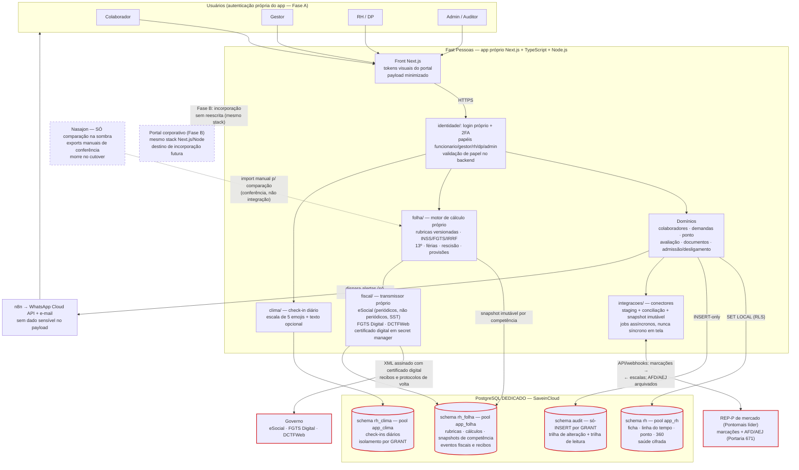

# Arquitetura do Sistema de RH/DP — Fast Pessoas

> **Status: ARQUITETURA v2 — revisada após decisões do usuário de 2026-07-24.**
> As decisões de plataforma (app próprio em 2 fases), stack (Next.js + TypeScript + Node.js), banco (PostgreSQL dedicado SaveinCloud) e folha (motor próprio + transmissão própria, sem Nasajon) estão **FECHADAS pelo usuário** e supersedem as recomendações da v1.
> A v1 (módulo no monorepo do portal + FastAPI + integração Nasajon) permanece nos anexos como histórico; suas premissas caíram.
> **Fase sem código: só documentos e protótipos HTML até autorização expressa.**

## Decisão de plataforma: app próprio em 2 fases

**Fase A (agora): app próprio e separado do portal corporativo.** O sistema nasce como aplicação independente, com autenticação e cadastro de usuários próprios, entregue cedo ao time de DP/RH para uso real, teste e proposição de melhorias. Objetivo: ciclo curto de feedback com quem opera o DP, sem depender do cronograma nem do repositório do portal.

**Fase B (futura): incorporação ao portal corporativo.** Correção de premissa importante registrada em 2026-07-24: **o portal corporativo real roda Next.js + TypeScript + Node.js com PostgreSQL dedicado na SaveinCloud** — o backend FastAPI/Python descrito nas fontes de conhecimento é o **MCP do SAP (conector)**, não o portal. Consequências diretas:

1. O app de RH e o portal compartilham o **mesmo stack** — a incorporação futura é reorganização/integração de código e identidade, **não reescrita**.
2. As afirmações das fontes sobre "herdar RLS/audit/RBAC do portal" (padrões FastAPI/asyncpg) provavelmente descrevem o MCP e **precisam ser re-verificadas na Fase B**. A Fase A **não conta com nada herdado**: todos os padrões inegociáveis são implementados no próprio app, em Node.
3. O mapeamento de identidade app ↔ portal (usuários, papéis, SSO ou fusão de bases) é trabalho da Fase B, com verificação in loco do que o portal realmente oferece.

**Por que 2 fases (e não módulo no monorepo desde já):** a v1 recomendava monorepo com base em duas premissas que caíram — (a) plataforma FastAPI pronta a herdar (era o MCP, não o portal) e (b) folha na Nasajon (agora é própria, o que muda o tamanho e o ritmo do sistema). Com stack idêntico ao do portal, o custo da separação temporária é baixo e o ganho de velocidade de entrega ao DP/RH é alto. A convergência na Fase B está garantida por construção: mesmo stack, mesmos tokens visuais, banco já dedicado.

## Arquitetura consolidada — Fast Pessoas (app próprio, Fase A)

### Componentes

| Camada | Escolha | Observação |
|---|---|---|
| Front | Next.js (App Router) + React + TypeScript | Tokens visuais do portal (#d21217, Instrument Sans/Lora, claro/escuro) desde o dia 1 para a Fase B ser indolor; `Intl` pt-BR |
| Back | Node.js + TypeScript (API do próprio Next.js e/ou serviços Node dedicados) | Domínios em pt-BR, camadas fixas por domínio: rotas → serviço → repositório → esquemas (validação por schema tipado, ex. Zod); queries parametrizadas obrigatórias |
| Banco | **PostgreSQL dedicado, hospedado na SaveinCloud** | Instância exclusiva do RH; schemas `rh`, `rh_folha`, `rh_clima`, `audit`; migrations SQL numeradas próprias; padrão expand/contract |
| Autenticação | Própria do app (Fase A) | Cadastro de usuários próprio; papéis funcionário/gestor/rh/dp/admin; 2FA para perfis DP/RH/admin; mapeamento com o portal fica para a Fase B |
| Folha | **Motor de cálculo próprio** + **transmissor próprio** | Rubricas, proventos/descontos, INSS/FGTS/IRRF, 13º, férias, rescisão, provisões; eSocial (periódicos, não periódicos, SST), FGTS Digital, DCTFWeb com certificado digital próprio |
| Ponto | REP-P de mercado contratado (Pontomais é a candidata líder, API verificada) | Só marcação + AFD/AEJ; espelho, tratamento, escalas, banco de horas e alimentação da folha são nossos, via API/webhooks |
| Integrações de mercado | Assinatura (Clicksign/ZapSign/D4Sign), admissão digital (Gupy Admissão ou Unico People — construir vs contratar em aberto), SST (SOC), benefícios (Flash/Swile/iFood) | Ver `docs/05-pesquisa-mercado.md`; um conector por sistema no domínio `integracoes/` |
| Avisos | n8n + WhatsApp Cloud API + e-mail transacional | n8n dispara e nunca decide/armazena; **sem dado sensível no payload** — só referências, RBAC no acesso |
| Nasajon | **Sem integração.** Fonte de comparação na sombra | Importação de resultados por relatórios/exports manuais durante o paralelo — conferência, não integração; referência funcional do que a folha própria precisa cobrir |
| IA | Claude via MCP, fase tardia, opcional | "IA conversa, backend guarda e calcula" — nunca calcula, nunca autoriza |

### Organização do código — domínios

```
app/
  dominios/
    identidade/          # usuários próprios, papéis, sessão, 2FA (Fase A); ponte com portal (Fase B)
    colaboradores/       # ficha, linha do tempo (evento_colaborador), ocorrências, feedback, cargos/CHA, relacao_gestor
    demandas/            # workflow genérico solicitante→executor + etapas de aprovação
    ponto/               # espelho, ajustes, jornadas/escalas, banco de horas (marcação vem do REP-P)
    folha/               # motor de cálculo: rubricas versionadas, encargos, 13º, férias, rescisão, provisões
    fiscal/              # transmissor: eSocial (S-1000..S-2299, SST), FGTS Digital, DCTFWeb; certificado digital; fila de eventos e recibos
    avaliacao/           # 360: ciclos, modelos versionados, flags, PDI (esqueleto btime revisado criticamente)
    clima/               # check-in diário de humor (schema com isolamento próprio)
    documentos/          # GED + ciência digital com hash
    recrutamento/        # requisição de vaga, pipeline de candidatos, ofertas (módulo 13; fim da Fase 2)
    admissao_desligamento/
    beneficios/          # cadastro na Fase 2 (catálogo, elegibilidade, adesão, variáveis para a folha); faturas/vidas/APIs de operadoras na Fase 3
    sst/                 # fases posteriores
    integracoes/         # um conector por sistema: rep_ponto/, assinatura/, sst_soc/, dw/ (analítico), nasajon_sombra/ (import manual, temporário)
```

Regras de fronteira: `folha/` calcula, `fiscal/` transmite — o transmissor nunca calcula e o motor nunca fala com o governo; ambos se comunicam por snapshot fechado de competência. `nasajon_sombra/` é um importador de arquivos de conferência com data de aposentadoria marcada (morre no cutover).

### Segurança e LGPD — banco dedicado

- **Instância PostgreSQL exclusiva do RH na SaveinCloud**: blast radius contido por construção; nenhum sistema comercial acessa o banco de RH. A segregação física que a v1 tratava como "plano de saída" é o ponto de partida da v2.
- **Credenciais segregadas por GRANT dentro da instância**: `app_rh` (domínios gerais), `app_folha` (schema `rh_folha` — só o motor e o fiscal escrevem lá), `app_clima` (schema `rh_clima`, **sem SELECT em identidade** — JOIN resposta×pessoa impossível por permissão, se a variante anônima for a escolhida), `app_audit_reader` (auditor, só leitura).
- **Dado de saúde (atestado/CID) cifrado na camada de aplicação (Node)**, chave em secret manager; gestor vê período de afastamento, nunca CID. Anexos em storage privado com URL assinada curta.
- **Certificado digital (e-CNPJ/e-CPF para eSocial/DCTFWeb) é segredo de mais alto grau**: guardado em secret manager/HSM da hospedagem, nunca em disco de app, acesso só pelo serviço transmissor, uso logado no audit.
- **Trilhas duplas no `audit`**: alteração E leitura de dado sensível (quem viu salário/atestado/nota bruta), desde a Fase 1.
- **LGPD por design**: minimização no schema, tabela de temporalidade por categoria (trabalhista 5–30 anos × clima × logs), RIPD antes de ponto (biometria do REP-P) e clima; conflito imutabilidade × eliminação resolvido por anonimização do domínio, nunca UPDATE no audit; fila de direitos do titular via demandas.
- **Risco assumido e registrado no log (2026-07-24)**: folha e transmissão fiscal próprias significam que erro de cálculo/transmissão é passivo nosso, não do fornecedor. Mitigação: paralelo com Nasajon até paridade comprovada (ver transição), massa de testes de cálculo versionada, produção restrita do eSocial antes de produção real.

### Padrões transversais inegociáveis — reimplementados em Node (nada vem "de graça")

A v1 assumia herdar estes padrões do portal; a v2 os implementa no próprio app. São fundação, nunca retrofit:

1. **PostgreSQL fonte única**; escrita sempre transacional; nada de arquivo-como-banco; **backup automático diário + WAL/PITR com restore testado** (primeiro restore comprovado é gate da Fase 0).
2. **Audit só-INSERT garantido por GRANT** (não por disciplina): a role da aplicação não tem UPDATE/DELETE no schema `audit`; diff campo a campo com rótulo resolvido; UTC no armazenamento + America/Sao_Paulo na exibição; duas trilhas (alteração + leitura sensível).
3. **Acesso por papel validado no backend**: toda rota valida permissão no servidor; payload minimizado — dado sensível não entra no JSON de quem não pode ver (ausência, não máscara). Front nunca é barreira de segurança.
4. **RLS via `SET LOCAL` no Postgres onde fizer sentido em Node**: cada transação abre com `SET LOCAL app.usuario_id`/`app.papel`; políticas RLS nas tabelas sensíveis; "gestor vê equipe" deriva exclusivamente de `relacao_gestor` vigente. Onde RLS não couber, a autorização equivalente vive no repositório do domínio e é coberta pela matriz de testes papel × recurso no CI.
5. **Versionamento de regra com vigência** (rascunho → ativa → encerrada, sem recálculo retroativo) para: **rubricas e parâmetros de folha (tabelas INSS/IRRF/salário-família, convenções coletivas)**, jornadas, tabela salarial, pesos/faixas da 360. "Fechado não reabre; correção é evento novo" — na folha própria isso é ainda mais crítico que na v1: competência fechada gera snapshot imutável ligado às versões de regra vigentes.
6. **Escrita transacional ponta a ponta**: fechamento de folha, efetivação de ajuste de ponto e desligamento são transações únicas com transições auditadas.
7. **Segredos só no servidor**; 2FA obrigatório para papéis dp/rh/admin e para ações `folha.fechar`, `fiscal.transmitir`, `documento.sensivel.ver`; sessão com timeout mais curto para esses perfis.
8. **Política de canais de aviso**: e-mail transacional é o canal padrão; WhatsApp Cloud API reservado a urgência, com opt-in do destinatário e custo por mensagem avaliado. Os módulos herdam esta política por referência, sem redefini-la.

### Deploy e método

- **Deploy próprio na SaveinCloud** (app Node + Postgres dedicado), pipeline simples com migrations expand/contract e testes por domínio como gate; **janela de congelamento de deploy amarrada ao calendário de fechamento de folha e aos prazos fiscais** (eSocial dia 15, FGTS Digital dia 20, DCTFWeb), ajustável pelo DP, exceção só com aprovação registrada.
- **Matriz de testes de autorização (papel × recurso) no CI**; para a folha, **suíte de casos de cálculo versionada** (casos reais anonimizados + casos de borda legais) que roda a cada mudança de regra.
- **Método (inalterado)**: protótipo HTML standalone com tokens visuais do portal → validação com DP/RH → código só com autorização expressa. Log de decisões (`decision-logger`) sempre. **Nada de código nesta fase — só documentos.**

### O que explicitamente NÃO entra

Registrador de ponto próprio (nem "coletor" — Portaria MTP 671/2021); armazenamento de biometria próprio; arquivo/planilha como fonte de dado; script local em máquina de funcionário; integração automática com o Nasajon (só importação manual de conferência durante a sombra); IA calculando ou autorizando qualquer coisa.

## Diagrama



## Decisões-chave

### Plataforma: app próprio separado (Fase A) → incorporado ao portal (Fase B) — **FECHADA pelo usuário (2026-07-24)**

**Recomendação:** Nasce app independente para entregar cedo ao DP/RH; incorporação ao portal fica para a Fase B. Tokens visuais do portal desde o dia 1 e mesmo stack garantem que a Fase B seja integração, não reescrita.
**Motivo:** A premissa da v1 (portal FastAPI com plataforma a herdar) estava errada — o FastAPI das fontes é o MCP do SAP; o portal real é Next.js/Node/Postgres SaveinCloud. Com stack idêntico, a separação temporária custa pouco e acelera a entrega de valor ao DP/RH.
**Status:** FECHADA. Pendência só da Fase B: re-verificar in loco o que o portal realmente oferece (RLS/audit/RBAC citados nas fontes podem ser do MCP) e desenhar o mapeamento de identidade.

### Stack: Next.js + TypeScript + Node.js, front e backend — **FECHADA pelo usuário (2026-07-24)**

**Recomendação:** Um único stack para app e (futuramente) portal. Os padrões inegociáveis (papel validado no backend, RLS via SET LOCAL, audit só-INSERT por GRANT, vigência, escrita transacional, backup+PITR testado) são implementados neste stack — **não existem "de graça"** e entram como fundação da Fase 0/1.
**Motivo:** É o stack que o time domina e o mesmo do portal — elimina o argumento da v1 de "reimplementar em Node custa mais", porque agora não há plataforma FastAPI a herdar de qualquer forma.
**Status:** FECHADA. A v1 (FastAPI/Python) está superada; o treino de Python da Fase 0 sai do roadmap.

### Banco: PostgreSQL dedicado na SaveinCloud — **FECHADA pelo usuário (2026-07-24)**

**Recomendação:** Instância exclusiva do RH desde o dia 1, com pools/roles segregados por GRANT (`app_rh`, `app_folha`, `app_clima`), cifração de dado de saúde, backups etiquetados por temporalidade, PITR com restore testado.
**Motivo:** Segregação física é a defesa LGPD mais forte (a v1 a tratava como "plano de saída"; a v2 nasce nela) e a folha própria eleva a sensibilidade do banco a outro patamar.
**Status:** FECHADA. Pendente apenas o provisionamento e o primeiro restore comprovado (gate da Fase 0).

### Folha: motor de cálculo E transmissão PRÓPRIOS; sem integração com Nasajon — **FECHADA pelo usuário (2026-07-24), risco assumido e registrado no log**

**Recomendação:** O sistema interno assume o que hoje é feito no Nasajon: motor completo (rubricas, proventos/descontos, encargos INSS/FGTS/IRRF, 13º, férias, rescisão, provisões, todas as regras versionadas com vigência) e transmissão das obrigações (eSocial — eventos periódicos, não periódicos e SST —, FGTS Digital, DCTFWeb) com certificado digital próprio. Nasajon vira referência funcional (o que cobrir) e fonte de comparação na sombra.
**Motivo:** Decisão do usuário; sem API pública de folha no Nasajon, a "integração" da v1 nunca teria transporte confiável. O risco regulatório de calcular e transmitir é assumido conscientemente e mitigado pela transição em paralelo (abaixo), pela suíte de casos de cálculo versionada e pelo spike de eSocial na Fase 0.
**Status:** FECHADA quanto ao rumo. Em aberto (design): catálogo inicial de rubricas, mapeamento das convenções coletivas do comércio por unidade, resultado do spike eSocial.

### Transição da folha: paralelo até paridade — **FECHADA pelo usuário (2026-07-24)**

**Recomendação:** Nasajon continua oficial enquanto a folha própria roda em sombra; resultados comparados por algumas competências, com importação dos resultados Nasajon via relatórios/exports manuais (conferência, não integração); relatório de divergência por rubrica e por colaborador a cada competência; **cutover só após paridade comprovada** (competências consecutivas sem divergência não explicada), com decisão de cutover registrada no log.
**Motivo:** É o único caminho que torna o risco da folha própria administrável: o número oficial segue sendo o do Nasajon até prova de paridade — invertendo o princípio da v1 apenas no momento do cutover.
**Status:** FECHADA. Em aberto: quantas competências de paridade exigir (proposta: mínimo 2 limpas consecutivas, incluindo uma com férias/desligamento reais) e a regra para o 13º (não fazer cutover entre novembro e janeiro).

### Ponto: REP-P de mercado (Pontomais candidata líder) só para marcação e AFD/AEJ — **FECHADA pelo usuário (2026-07-24)**

**Recomendação:** Contratar registrador homologado exclusivamente para marcação e arquivos fiscais (AFD/AEJ). Espelho, tratamento de ocorrências, jornadas/escalas, banco de horas e **alimentação da folha própria** são do nosso sistema, via API/webhooks do fornecedor. Cláusulas contratuais: exportação AFD/AEJ e histórico completo, API de marcações verificada, reexportação retroativa. **Nunca desenvolver registrador próprio** (nem "coletor" — Portaria MTP 671/2021).
**Motivo:** Registrador é software regulado (INPI, atestado técnico); o valor está no tratamento, não na captura. Como a folha agora é nossa, o ponto alimenta o motor diretamente — sem o intermediário Nasajon da v1.
**Status:** FECHADA quanto ao modelo. Em aberto: cotação formal (Fase 0) — Pontomais lidera com API verificada; RIPD antes da contratação se houver biometria.

### Avaliação 360: esqueleto btime, revisto criticamente — em aberto no design

**Recomendação:** Usar o material da btime como **esqueleto base** (pilares, ciclos de Experiência 45/90d e Desempenho, escala 1–5, faixas com flags e decisão humana com justificativa), mas **rever criticamente** o modelo — o material é superficial e tem erros estruturais; nada é adotado cegamente. Regras 100% administráveis pelo RH com vigência. Os 9 Valores Fast entram como régua do pilar cultural, sujeitos à mesma revisão.
**Motivo:** Aproveita o que já foi pensado sem herdar os erros; a interface é refeita nos tokens do portal de qualquer forma.
**Status:** Rumo definido; modelo em aberto. **O usuário TEM o código da btime — pedir quando o design do módulo começar.**

### Clima: check-in diário simples de humor — **FECHADA pelo usuário (2026-07-24) quanto ao formato; variante de anonimato em aberto**

**Recomendação:** Perguntas diárias curtas ("como você está se sentindo hoje?", "como você tem se sentido a respeito de suas entregas?") respondidas numa escala de 5 emojis (chorando / triste / neutro / sorrindo / sorrindo com estrelas) + campo de texto opcional. Muito mais simples que pesquisas periódicas/eNPS pesado — cabe cedo no roadmap.
**Questão aberta a levar ao design, com duas variantes a apresentar:**
- **Variante A — anônimo agregado:** resposta sem FK para pessoa, agregação k≥5 por unidade/equipe; máxima honestidade de resposta, nenhum alerta individual possível.
- **Variante B — identificado com alerta:** resposta ligada à pessoa; sequências negativas geram alerta ao gestor/RH; permite cuidado individual, mas exige base legal clara, transparência total com o colaborador e reduz a franqueza.
- **Recomendação do arquiteto:** começar pela **Variante A** (anônima), que preserva confiança e simplifica LGPD; evoluir para um modo híbrido opt-in ("quero que o RH veja meu nome") apenas se o DP/RH sentir falta do alerta individual após alguns meses de uso. Decisão final com o usuário no design do módulo.
**Status:** Formato FECHADO; variante de anonimato EM ABERTO (apresentar as duas no protótipo).

### Identidade na Fase A: autenticação e cadastro próprios — **FECHADA pelo usuário (2026-07-24)**

**Recomendação:** O app tem usuários próprios com papéis funcionário/gestor/rh/dp/admin; criação de acessos para todos os colaboradores não é problema segundo o usuário. Colaborador é entidade de RH com **matrícula própria** (chave interna); "gestor" deriva de `relacao_gestor` com vigência, nunca de flag manual. 2FA para dp/rh/admin.
**Motivo:** Elimina a dependência do portal como gate da Fase 1 (o maior atraso das propostas de app separado na v1). O mapeamento com os usuários do portal é problema da Fase B.
**Status:** FECHADA para a Fase A. Fase B: estratégia de mapeamento/fusão de identidades a desenhar.

### Auditoria em duas trilhas + versionamento com vigência na fundação — mantida da v1, agora implementada em Node

**Recomendação:** Trilha de alteração (audit só-INSERT por GRANT) + trilha de leitura de dado sensível desde a Fase 1; vigência para toda regra parametrizável; "fechado não reabre". Com folha própria, a exigência sobe: cada competência fechada referencia as versões exatas de rubricas e tabelas legais usadas no cálculo.
**Motivo:** Barato no início, caríssimo de retrofitar; sem isso, um fechamento de folha própria é indefensável em fiscalização ou reclamatória.
**Status:** Fechada como princípio; entra como critério de gate da Fase 1.

### Ferramentas de mercado por função — pesquisa verificada (docs/05-pesquisa-mercado.md)

**Recomendação:** Pontomais (ponto), Clicksign/ZapSign/D4Sign (assinatura eletrônica), Gupy Admissão ou Unico People (admissão digital — **construir vs contratar ainda em aberto**), SOC (SST), WhatsApp Cloud API via n8n + e-mail transacional (avisos), Flash/Swile/iFood (benefícios). Cada contratação segue o padrão do domínio `integracoes/`: contrato tipado, staging, conciliação, snapshot imutável do que entra, plano B batch.
**Motivo:** Comprar o commodity regulado/operacional, construir o que é diferencial (tratamento, workflow, folha por decisão do usuário).
**Status:** Lista validada por pesquisa; contratações individuais decididas por fase, com cotação na Fase 0 para o ponto.

## Modelo de domínio — entidades centrais por contexto

Convenções: schemas `rh` (geral), `rh_folha` (motor + fiscal), `rh_clima` (check-in), `audit`; toda entidade parametrizadora segue versão com vigência (rascunho → ativa → encerrada, sem recálculo retroativo); datas em UTC; dado de saúde cifrado em aplicação.

### Núcleo de pessoas — espinha dorsal (primeiro artefato de dados)
- **`colaborador`** — entidade central com **matrícula própria** (chave interna do sistema; a matrícula Nasajon deixa de ser chave de correlação — pode ser guardada como campo informativo durante a sombra). **`tipo_vinculo`** desde o dia 1 (CLT, estagiário, aprendiz, PJ, temporário — com regras por tipo; retrofit atinge ponto, folha e 360), datas, status, retrato/contexto. 1:1 com `usuario` próprio do app (Fase A).
- **`usuario`** — identidade própria do app: credenciais, papel (funcionário/gestor/rh/dp/admin), 2FA, sessões. Na Fase B ganha o mapeamento para o usuário do portal.
- **`evento_colaborador`** — a linha do tempo, **append-only**, payload JSONB validado por tipo (admissão, promoção, reajuste, ocorrência, feedback, afastamento, férias, advertência, treinamento, avaliação concluída, desligamento) + referência à entidade de origem + resumo legível. Todo módulo escreve aqui; é projeção para consulta, nunca base de cálculo. **Espinha dorsal mantida da v1.**
- **`ocorrencia`**, **`feedback_formal`** (cadência-alvo 90d com alerta), **`acao_aberta`**.
- **`cargo`** + **`cargo_versao`** (CHA estruturado), **`tabela_salarial_versao`**, **`posicao_colaborador`** (histórico cargo+salário por vigência — nova linha, nunca UPDATE).
- **`empregador`** + **`estabelecimento_versao`** (vigência) — CNPJ (matriz/filiais das 5 unidades), RAT/FAP, FPAS/terceiros, CNAE/grau de risco (insumo também do SST/NR-4), endereço; fonte do S-1000/S-1005 e dos encargos patronais por estabelecimento.
- **`relacao_gestor`** (vigência; base do "gestor vê equipe" e da 360), **`lotacao`** (unidade × centro de custo com vigência, ancorada em `estabelecimento_versao`), **`dependente`** (insumo direto de IRRF e salário-família na folha própria — dado de terceiro, LGPD própria).

### Demandas e workflow
- **`demanda`** (solicitante→executor, tipo, status, prazo, prioridade) + **`etapa_aprovacao`** + transições auditadas + notificação n8n/WhatsApp. Motor genérico de: documentos, ajuste de ponto, férias, benefícios, pendências DP↔funcionário, fila LGPD.
- **`checklist_processo`** / **`item_checklist`** — motor de admissão e desligamento.

### Documentos / GED
- **`documento`** (tipo, storage privado, hash SHA-256, sensibilidade, temporalidade) + **`ciencia`** (quem, quando, hash no momento). Holerites agora são **gerados pelo próprio sistema** e publicados aqui. Assinatura qualificada via integração (Clicksign/ZapSign/D4Sign) onde exigida. Acesso a documento sensível grava trilha de leitura.

### Ponto (consumo e tratamento; captura é do REP-P)
- **`jornada_versao`** (5x2, 6x1, 12x36, intervalos, tolerâncias — convenções coletivas por unidade levantadas antes de modelar), **`escala_colaborador`** (vigência), **`feriado`** por município/unidade.
- **`marcacao_importada`** (via API/webhook do REP-P, staging + conciliação), **`arquivo_fiscal_ponto`** (AFD/AEJ arquivados — guarda legal), **`espelho_ponto`** (consolidação por competência contra jornada vigente), **`ocorrencia_ponto`**, **`ajuste_ponto`** (solicitação→aprovação→efetivação, cada transição no audit), **`banco_horas`** (saldo por evento).
- Saída do domínio: **variáveis de ponto alimentam diretamente o motor de folha próprio** (horas extras, adicional noturno, faltas, DSR) — sem intermediário externo.

### Folha própria — motor de cálculo (schema `rh_folha`)
- **`rubrica`** + **`rubrica_versao`** — catálogo de proventos/descontos/bases com fórmula parametrizada, incidências (INSS, FGTS, IRRF, DSR) e vigência. **Nenhuma rubrica sem versão.**
- **`tabela_legal_versao`** — INSS (faixas), IRRF (faixas + deduções), salário-família, salário-mínimo, tetos — versionadas com vigência por competência.
- **`parametro_convencao`** — pisos, percentuais e benefícios normativos por convenção coletiva do comércio, por unidade, com vigência.
- **`competencia_folha`** — máquina de estados (canônica, a mesma do módulo 03): aberta → calculo → conferencia → aprovada → **fechada** → paga → obrigacoes_transmitidas. Fechada nunca reabre; correção é competência complementar/retificação formal.
- **`variavel_folha`** (origem rastreada: ponto, afastamento, benefício, comissão do DW, lançamento manual auditado), **`calculo_item`** (resultado por colaborador × rubrica, com memória de cálculo e referência às versões usadas), **`provisao`** (férias, 13º, encargos), **`snapshot_fechamento`** (imutável, liga o resultado às versões exatas de regra/tabela vigentes), **`holerite`** (gerado internamente, publicado no GED com ciência).
- **Tipos de competência**: mensal, adiantamento, 13º-1ª parcela, 13º-2ª parcela, férias, rescisão (com verbas e prazos do art. 477), complementar.
- **`comparacao_sombra`** — importa resultado Nasajon (export manual), casa por colaborador × rubrica, gera **`divergencia_sombra`** com fila de explicação/resolução. Vive só até o cutover.

### Fiscal — transmissor próprio (schema `rh_folha`)
- **`evento_esocial`** — fila de eventos por tipo (tabelas S-1000/1005/1010/1020; não periódicos S-2190 admissão preliminar, S-2200 admissão, S-2205/2206 alterações, S-2230 afastamento, S-2299 desligamento; periódicos S-1200 remuneração, S-1210 pagamentos, S-1299 fechamento; S-3000 exclusão de evento; SST S-2210/2220/2240), com estado (pendente → assinado → transmitido → aceito/rejeitado), XML gerado, **recibo/protocolo arquivado**, erro estruturado para retrabalho.
- **`transmissao_fgts_digital`**, **`declaracao_dctfweb`** — geração, envio e comprovantes por competência.
- **`certificado_digital`** — metadados (validade, alerta de vencimento); o material criptográfico vive no secret manager, nunca no banco.
- **`obrigacao_competencia`** — agenda de compliance (eSocial, FGTS Digital dia 20, DCTFWeb, marcos de 13º) com status e alerta — agora monitorando **as nossas próprias transmissões**.

### Avaliação 360 (esqueleto btime revisado)
- **`modelo_avaliacao_versao`** (pilares/pesos/faixas — revistos criticamente no design, 100% administráveis com vigência), **`ciclo`** (Experiência 45/90d amarrado ao contrato de experiência; Desempenho periódico), **`avaliacao`**, **`resposta_item`**, **`resultado_consolidado`**, **`flag_recomendacao`** + **`decisao_humana`** (justificativa obrigatória se divergir), **`pdi`**, **`card_colaborador`** (nasce privado).

### Clima — check-in diário (schema `rh_clima`)
- **`pergunta_checkin`** (catálogo curto, versionado), **`resposta_checkin`** — escala de 5 emojis + texto opcional; **modelagem final depende da variante escolhida** (A: sem FK para pessoa, só unidade/período, agregação k≥5; B: com FK e regras de alerta). O schema isolado por GRANT vale nas duas variantes.
- **`agregado_clima`** — série temporal por unidade/equipe para o painel do RH.

### Férias, afastamentos, admissão/desligamento
- **`periodo_aquisitivo`** (alerta de vencimento — vencida = dobro), **`programacao_ferias`** (workflow sobre demandas, fracionamento legal); **cálculo de férias é do motor próprio** (terço, abono, médias).
- **`afastamento`** — tipo, período, documento (saúde cifrada; gestor vê período, nunca CID). Reflete no ponto, nas férias e **gera S-2230 pelo nosso transmissor**.
- **`processo_admissao`** (checklist; admissão digital via Gupy/Unico ou fluxo próprio — em aberto; contrato de experiência amarrado ao ciclo 45/90d; **S-2200 é nosso**) e **`processo_desligamento`** (art. 477, exame, devoluções, desativação do usuário do app na mesma transação, entrevista estruturada; **rescisão calculada pelo motor e S-2299 pelo transmissor**).

### Benefícios e SST
- **`beneficio`** (elegibilidade versionada), **`adesao`**, **`movimentacao_operadora`** (Flash/Swile/iFood via conector); descontos entram como `variavel_folha` do **motor próprio**.
- **`aso`** (vencimento + convocação), **`cat`**, **`epi_catalogo`**/**`epi_entrega`** (ciência por hash). Exames com SOC via conector; para os eventos SST do eSocial (S-2210/2220/2240), **o destino desenhado é a transmissão própria (Rota B), migrada evento a evento após o gate F4, começando pelo S-2210**; a Rota A (clínica/SOC transmite) é o estado de partida e pode ser mantida por evento apenas por decisão registrada no log — ver as duas rotas no módulo 12.

### Transversais
- **`audit`** — duas trilhas (alteração + leitura de dado sensível), só-INSERT por GRANT.
- **Staging de integração** — uma tabela por entidade importada (REP-P, assinatura, SOC, DW, sombra Nasajon), com log de carga, conciliação e fila de divergências; snapshot imutável de tudo que entra.
- **Central de Metas de Indicadores** (decisão do usuário, 2026-07-27: **nenhuma meta fixa em código**) — **`indicador`** (catálogo administrável pelo RH: chave, nome, área/módulo de origem, descrição/fórmula, unidade de medida, direção maior-melhor/menor-melhor, visibilidade por papel) + **`meta_indicador_versao`** (FK indicador, escopo global ou por unidade, valor, **versionada com vigência** — nova meta encerra a anterior, nunca sobrescreve; período já apurado continua avaliado pela meta da época). Página própria de administração ("Metas de Indicadores", protótipo em `prototipos/metas-indicadores.html`); todo KPI do sistema — inclusive o % de entrevistas de desligamento — busca sua meta aqui, nunca em constante de código. Regras de elegibilidade de denominador (ex.: justa causa conta?) são configuração do `indicador`.

## Roadmap v2 — fases com entregável validável e critério de pronto

Princípios do roadmap: (1) **entregar cedo algo testável ao DP/RH** — a espinha dorsal + demandas + clima diário chegam antes de qualquer coisa de folha; (2) **a folha própria é uma trilha longa que corre em paralelo** (motor → sombra → paridade → cutover) sem segurar as entregas rápidas; (3) todo fluxo nasce como protótipo HTML standalone (tokens do portal, papel simulado) validado com DP/RH **antes de qualquer código**; código só com autorização expressa; log de decisões sempre.

### Fase 0 — Descobertas + fundação (3–5 semanas, sem código de produto)
**Objetivo:** destravar contratações e riscos técnicos, e montar a base que não se retrofita.
**Atividades:**
1. **Spike técnico de eSocial (item crítico novo):** estudar os webservices do governo (protocolo de comunicação, lotes, assinatura), obter/validar **certificado digital** (e-CNPJ, procurações), leiautes vigentes (S-1.x/S-2.x) e **acesso ao ambiente de produção restrita** do eSocial; transmitir um evento de tabela (S-1000) de teste com sucesso. Mapear FGTS Digital e DCTFWeb no mesmo espírito. Saída: relatório de viabilidade com esforço estimado por grupo de eventos.
2. **Cotação e contratação do REP-P:** Pontomais como candidata líder (API verificada); critérios — 1º API de marcações/webhooks, 2º exportação AFD/AEJ + histórico + reexportação retroativa, 3º custo por colaborador; RIPD antes de assinar se houver biometria.
3. **Levantamento funcional da folha a partir do Nasajon:** catálogo de rubricas em uso, convenções coletivas por unidade, tipos de vínculo e particularidades reais — o Nasajon como **referência funcional** do que o motor precisa cobrir; definir formato dos exports manuais de conferência para a sombra.
4. **Definição do processo de admissão digital:** construir vs contratar (Gupy Admissão / Unico People) — decisão com custo e prazo na mesa.
5. **SST:** mapear com a clínica/SOC quem transmite o quê hoje e o que migra para o nosso transmissor.
6. **LGPD:** RIPD de ponto e clima; tabela de temporalidade por categoria; registro formal (log) do risco assumido da folha própria.
7. **Plataforma:** provisionar o **PostgreSQL dedicado na SaveinCloud**; schemas, roles/pools por GRANT, tabelas de audit (duas trilhas), migrations de fundação, backup + **PITR com restore testado**; esqueleto do app Next.js/Node com autenticação própria e 2FA (fundação, não produto).
8. **Protótipos HTML:** ficha/linha do tempo, demandas, check-in de clima (com as DUAS variantes de anonimato lado a lado), espelho de ponto.
**Entregável validável:** protótipos aprovados por DP/RH; relatório do spike eSocial; cotação REP-P assinável; dossiê de rubricas/convenções.
**Critério de pronto (gate 0→1):** restore de backup comprovado ao menos uma vez; migrations de fundação em homologação; evento de teste aceito na produção restrita do eSocial **ou** plano B documentado com prazos; contrato REP-P encaminhado; variante de clima decidida com o usuário.

### Fase 1 — Espinha dorsal + primeiras entregas ao DP/RH (2–3 meses)
**Objetivo:** o DP/RH usando o sistema no dia a dia o mais cedo possível — este é o "entregar cedo para testar e propor melhorias" da decisão de plataforma.
**Módulos:** autenticação própria + cadastro de usuários e papéis; `colaborador` com **matrícula própria** + `evento_colaborador` (linha do tempo append-only); ocorrências + feedback formal + ações; cargos/CHA + tabela salarial versionada + histórico de posição; `relacao_gestor` e lotação com vigência; **demandas** com aprovação + avisos n8n/WhatsApp/e-mail (primeiro módulo transacional, risco regulatório zero); GED mínimo (documento + ciência com hash); **clima check-in diário MVP** (é simples e vem cedo — na variante decidida na Fase 0, com painel agregado para o RH).
**Entregável validável:** ficha viva com linha do tempo real de um grupo piloto; demandas operando para o DP; check-in diário rodando com adesão medida; cada tela com protótipo aprovado antes do código.
**Critério de pronto (gate 1→2):** audit (duas trilhas) e autorização papel × recurso cobertos por teste no CI; DP usando demandas em produção; check-in com primeiras semanas de série histórica; zero cadastro duplicado de pessoas dentro do app.

### Fase 2 — Operação do DP: ponto, ciclo de pessoal e documentos (4–6 meses, entregas incrementais por feature flag)
**Objetivo:** o mês operacional do DP (fora o cálculo da folha) rodando no sistema.
1. **Admissão** (checklist; digital própria ou contratada conforme Fase 0) e **afastamentos** (saúde cifrada) — antes do ponto, para não acusar falta indevida.
2. **Jornadas/escalas versionadas + ponto**: integração REP-P (API/webhooks), espelho contra jornada vigente, ajuste com workflow auditado, banco de horas, arquivamento AFD/AEJ.
3. **Férias**: períodos aquisitivos, painel de vencimento (vencida = dobro), programação sobre demandas.
4. **Desligamento**: checklist art. 477, desativação do usuário na mesma transação, entrevista estruturada **com indicador oficial de cobertura (% de entrevistas realizadas — KPI do setor, pedido da Diretoria de Pessoas) e trava de encerramento: todo desligamento fecha com desfecho de entrevista registrado (realizada/recusada/não realizada com motivo)**.
5. **Assinatura eletrônica** integrada ao GED (Clicksign/ZapSign/D4Sign) onde houver exigência.
6. **Avaliação 360 v1** (líder→liderado, esqueleto btime revisado — **pedir o código da btime ao usuário no início deste design**).
7. **Benefícios (cadastro)**: catálogo + elegibilidade + adesão + variáveis para a folha própria + relatório de transição — insumo obrigatório da paridade da folha-sombra (VT 6%, VR/VA, coparticipação); o passo 2 (faturas, movimentação de vidas, APIs Flash/Swile/iFood) fica na Fase 3.
8. **Recrutamento e seleção — núcleo** (módulo promovido a primeira classe em 2026-07-27, ver `13-recrutamento-selecao.md`): requisição de vaga com aprovação e controle de headcount, vaga derivada de cargo/CHA com faixa salarial, pipeline de candidatos com etapas configuráveis e pareceres, oferta dentro da banda, e **aprovado dispara a admissão digital automaticamente** — fecha o fluxo requisição → seleção → admissão → colaborador ponta a ponta. Página de carreiras completa, testes online e sourcing externo ficam na Fase 3.
**Entregável validável por item:** protótipo aprovado → módulo em produção sozinho via flag; nunca big bang.
**Critério de pronto:** ponto com um mês de espelho conciliado com o REP-P sem divergência não explicada; primeiro ciclo de Experiência da 360 concluído com decisão humana registrada.

### Trilha F — Folha própria (paralela, começa na Fase 1 e atravessa as demais; 9–15 meses até o cutover)
**Objetivo:** motor → sombra → paridade → cutover, sem prazo artificial — o gate é paridade, não calendário.
- **F1 — Motor mínimo (durante Fases 1–2):** rubricas versionadas + tabelas legais + cálculo mensal CLT padrão (salário, HE, adicional noturno, faltas/DSR, INSS/FGTS/IRRF); suíte de casos de cálculo versionada desde o primeiro caso. *Pronto quando:* casos da suíte batem com contracheques reais recalculados à mão.
- **F2 — Cobertura completa:** férias (médias, terço, abono), 13º (1ª/2ª), rescisão (verbas, art. 477), afastamentos, provisões, tipos de vínculo, convenções por unidade. *Pronto quando:* todo tipo de evento do último ano da empresa é calculável.
- **F3 — Sombra:** competências reais calculadas em paralelo; `comparacao_sombra` contra exports manuais do Nasajon; toda divergência explicada ou corrigida. **A paridade pressupõe o de-para benefício×rubrica ativo** (cadastro de benefícios da Fase 2 alimentando VT 6%, VR/VA e coparticipação como variáveis da folha). *Pronto quando:* **paridade comprovada — mínimo 2 competências consecutivas limpas, incluindo ao menos uma com férias/rescisão reais** (parâmetro a fechar com o usuário).
- **F4 — Fiscal em produção restrita:** eventos de tabela + S-1200/S-1210 gerados a partir da sombra e aceitos na produção restrita do eSocial; FGTS Digital e DCTFWeb simulados. *Pronto quando:* uma competência inteira aceita sem rejeição estrutural.
- **F5 — Cutover:** decisão registrada no log; nunca entre novembro e janeiro (13º); primeira competência oficial com dupla conferência; Nasajon descontinuado após a guarda dos históricos exportados (snapshot no nosso banco). Holerites passam a ser gerados e publicados pelo sistema.
**Regra permanente da trilha:** até o cutover, **o número oficial é o do Nasajon**; depois dele, o painel de obrigações monitora as nossas próprias transmissões com alerta por prazo.

### Fase 3 — Expansão e inteligência (contínua, pós-cutover em diante)
**Módulos:** 360 completa (pares, autoavaliação, Card, PDI); benefícios passo 2 (faturas, movimentação de vidas, APIs Flash/Swile/iFood — o cadastro e as variáveis de folha chegam na Fase 2); SST completo (ASO com convocação, CAT, EPI; eventos SST migrados à transmissão própria — Rota B do módulo 12 — evento a evento após o gate F4, começando pelo S-2210); painel de obrigações com todas as competências; people analytics (turnover, absenteísmo, horas extras, custo por centro de custo, headcount, **% de entrevistas de desligamento realizadas — série histórica do KPI que nasce no MVP do desligamento**; cruzamento DW × desempenho comercial; **vedado desempenho × saúde**); R&S evolução (página de carreiras completa, testes online integrados, sourcing/integração Gupy se o volume justificar — o núcleo chega no fim da Fase 2, módulo 13); fila LGPD do titular + relatório de acessos a dado sensível; agente de DP conversacional (IA via MCP — conversa, nunca calcula); **Fase B da plataforma**: verificação in loco do portal, mapeamento de identidade e incorporação — sem reescrita, por construção.
**Critério permanente:** cada módulo segue protótipo → validação → flag → produção; qualquer exceção aos princípios exige registro no log de decisões.

## Como se chegou aqui

A v1 nasceu de três propostas independentes julgadas por três lentes (custo/time-to-value, manutenibilidade, risco regulatório/LGPD) — o material completo está em `anexos/` e o histórico de escolhas no log de decisões. Esse julgamento ficou **histórico**: em 2026-07-24 o usuário corrigiu a premissa central (o portal real é Next.js/Node, não FastAPI — o FastAPI é o MCP do SAP) e fechou decisões que invertem as recomendações da v1 (app próprio em 2 fases, stack Node, banco dedicado, folha e transmissão fiscal próprias sem Nasajon). Esta v2 é o desenho que obedece a essas decisões; os motivos de cada uma estão registrados no log de decisões com data de 2026-07-24.
